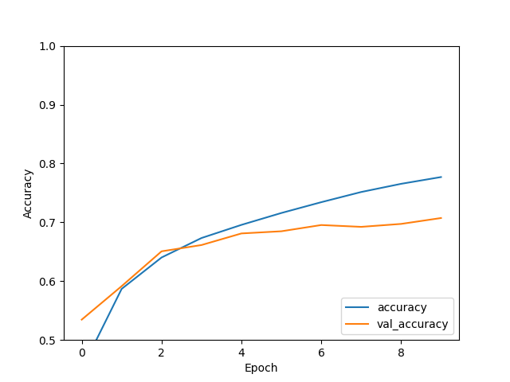
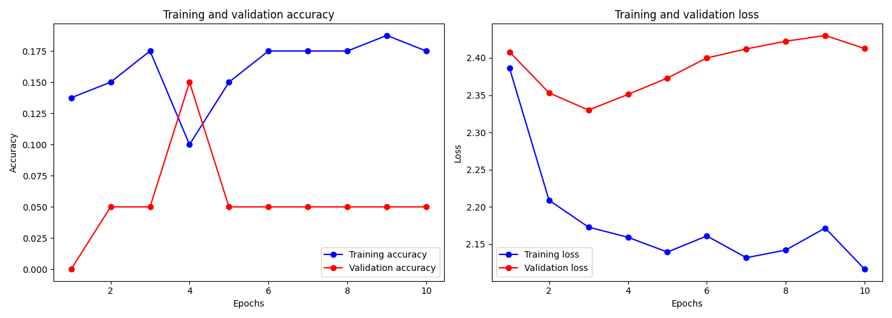

# 🚀 AI for the Social Media Era 🚀

Hey there, tech-savvy squad! Welcome to our quick, no-BS guide on getting your AI models up and running faster than you can say "TikTok". Dive into the world of deep learning without the deep confusion. 🧠✨

## What's Cooking? 🍳

We've got three mouth-watering recipes for you:

1. **The Classic - A basic neural network**: Perfect for newcomers. It's like the grilled cheese of neural networks, using the MNIST dataset. 📈

2. **Linear Regression - But make it TensorFlow**: This ain't your grandpa's stats class. Predict real stuff, like how much coffee you'll need to code all night. ☕🌙

3. **Cinema Critic - Our Convolutional LSTM model**: Binge-watch your way to a model that understands videos better than you do. 🎥💡

## Installation & Setup 🛠️

Before you jump in, make sure you have the following:

- Python installed (duh!). If you don't, are you even living in 2024? Download it [here](https://www.python.org/downloads/).
- TensorFlow, because we're fancy and we like to make computers learn stuff.
- TensorFlow Datasets, 'cause who has time to organize data?
- TensorFlow Text and Matplotlib, for when you need to plot that victory graph.

Run this in your command line, and you'll be golden:

```bash
pip install tensorflow tensorflow-datasets tensorflow-text matplotlib
```

## 1. The Classic: Basic Neural Network 🍞

Straight outta your intro to AI class, this model uses the MNIST dataset. It's like the ABCs but for recognizing handwritten digits.

Here's the gist:

- Load and preprocess data.
- Build and compile a Sequential model with Keras.
- Normalize data because we're tidy.
- Train and validate, then watch the accuracy like your favorite series' finale.

Check out `mnist.py` for the full code.

## 2. Gradint: Linear Regression, TensorFlow Style 📊

Ever wondered if there's a pattern in life? Well, there is in data. This script shows you how to predict outcomes with a linear relationship. Simple yet effective, like avocado toast.

Peep the code in `gradint.py`.

## 3. Cinema Critic: Understand Videos with Convolutional LSTM 🎬

Prepare to be mind-blown. This script takes video data and actually understands it (kinda). Perfect for your next TikTok-inspired project.

Dive into `transformer.py` and start predicting the next viral trend.

## Visualize to Actualize 🌈

We don't stop at just building models. We show you how they did! With our code, you'll plot training and validation accuracy and loss, making your results Insta-worthy.

## Go Beyond 🚀

Think this is cool? You can do so much more! Customize, experiment, and maybe even start predicting the future (disclaimer: time machine not included).

## What's Next?

- Explore other datasets; switch up the models.
- Break stuff (in code); learn more.
- Join a hackathon, maybe?
- Follow us on [GitHub](https://www.github.com/bdr-pro).

Remember, whether you're here to build the next big algorithm or just trying to pass your AI class, we've got your back. Let's make something awesome together!

---



